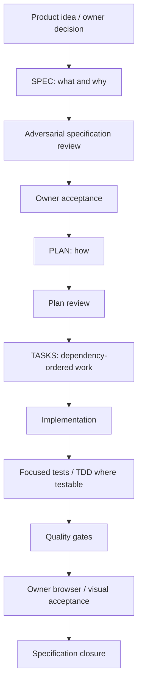
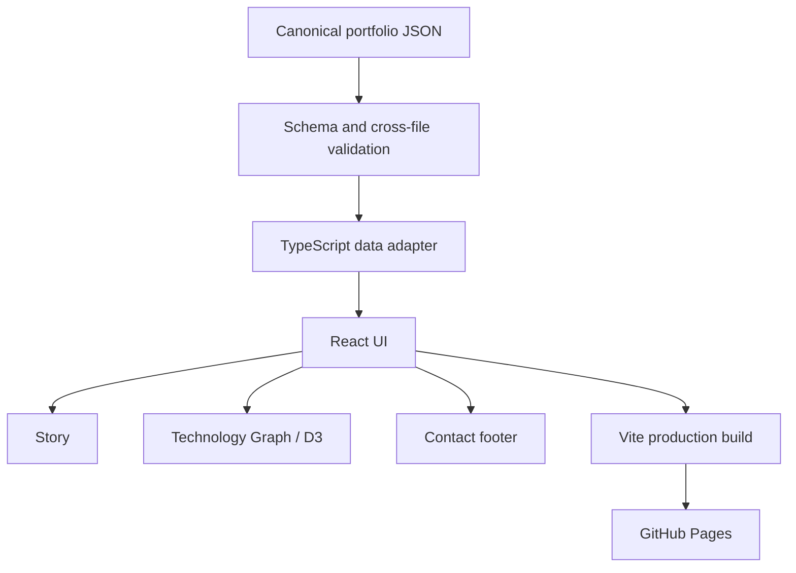

# hmeclazcke-portfolio

[Live site](https://hmeclazcke.github.io/hmeclazcke-portfolio/)

Hernán Meclazcke's technical portfolio is a static single-page React application. It is not a CV clone: it presents a concise technical identity, a career and learning Story, evidence-oriented technology relationships, and minimal profile contact links.

## Project status

**Complete.** The approved product scope is the static portfolio deployed through GitHub Pages. There is no active specification and no committed next phase. Any future change begins with a new owner-approved specification.

## Product experience

- **Home** — concise technical introduction and entry points.
- **Explore My Story** — responsive career and learning chronology.
- **Technology Graph** — an interactive D3 graph of technologies derived from structured usage and learning contexts, rather than a flat skill list.
- **Contact footer** — LinkedIn and GitHub links with the decorative Piedra Movediza composition.

Detailed professional employment history remains on LinkedIn. The repository documentation explains the engineering work behind the portfolio; it is not another public site section.

## Built with Spec-Driven Development

This project was developed end-to-end with a repository-specific Spec-Driven Development (SDD) workflow. SDD here means that product decisions remained owner-controlled, while implementation and review work followed explicit, versioned artifacts.



In this repository:

- one specification was active at a time;
- a **SPEC** defined product intent and constraints, a **PLAN** described the smallest implementation approach, and **TASKS** ordered the work;
- testable behavior used focused TDD and regressions; visual results also required owner browser review;
- adversarial reviews challenged ambiguity, scope creep, and unsupported architecture before work advanced;
- Codex acted as an implementation and review agent, while the owner controlled product decisions and acceptance;
- the agent did not independently commit or push;
- specifications could be deferred, archived, or merged when the product direction changed.

That last point mattered: not every explored idea became a feature. SPEC-014 was merged into SPEC-013, and the owner ultimately concluded that the completed static portfolio met the product goal without adding backend, API, MCP, or runtime GitHub capabilities.

## Technology stack

| Area | Technologies |
| --- | --- |
| Frontend | React, TypeScript, Vite |
| Visualization | D3 force simulation |
| Data validation | JSON Schema, Ajv |
| Testing | Vitest, React Testing Library, jsdom, axe-core |
| Quality | ESLint, Prettier, TypeScript |
| Delivery | GitHub Actions, GitHub Pages |

Space Grotesk and JetBrains Mono are self-hosted local Fontsource assets. This list describes the portfolio implementation, not the full technology inventory represented in the graph.

## Architecture

The application is intentionally static. Canonical portfolio facts are version-controlled JSON, validated before build, adapted into TypeScript, and consumed by the React UI.



The graph derives visible technology relationships from structured context evidence. UI components do not hardcode the portfolio's technology relationships.

## Repository structure

```text
.
├── frontend/  # React application and frontend validation tooling
├── data/      # canonical portfolio data and JSON Schemas
├── docs/      # product, architecture, SDD records, and specifications
├── .github/   # GitHub Pages workflow
└── AGENTS.md  # repository working and governance rules
```

Start with [docs/vision.md](docs/vision.md), [docs/architecture.md](docs/architecture.md), [docs/roadmap.md](docs/roadmap.md), [docs/current.md](docs/current.md), and [docs/specs/](docs/specs/) to inspect the completed SDD record.

## Local development

Prerequisite: Node.js 24 LTS. Run frontend commands from `frontend/`.

```powershell
cd frontend
npm install
npm run dev
```

Useful commands:

```powershell
npm run test:run
npm run format:check
npm run lint
npm run typecheck
npm run validate:data
npm run build
npm run preview
```

The automated quality gates cover formatting, linting, TypeScript, the full test suite, canonical-data validation, and the Vite production build.

## Deployment

Pushes to `main` run the GitHub Actions Pages workflow. It installs frontend dependencies, runs the quality gates, builds `frontend/dist`, and publishes the resulting static artifact to GitHub Pages at the live site above.

## Future changes

The current product scope is complete. Future changes, if any, require a new owner-approved specification.
